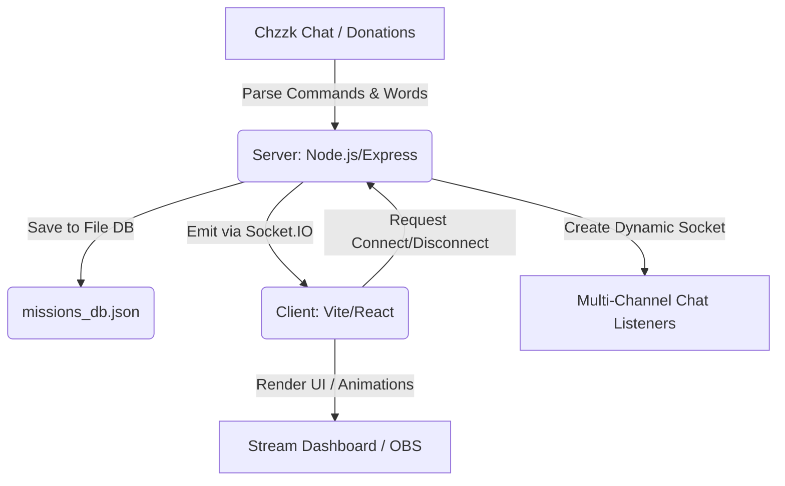

# Chzzk Mission Management System (치지직 미션 도우미 찌모의 놀이터)

이 프로젝트는 치지직(Chzzk) 스트리밍 채팅을 실시간으로 감시하여 각종 미션과 이벤트를 파싱하고, 이를 세련된 전용 대시보드(오버레이)에 인터랙티브하게 표시하는 시스템입니다. 단일 채널을 넘어 여러 멤버의 크루 방송을 동시 관제할 수 있는 **[다중 채널 연결 기능]**과 시청자 반응을 수치화하는 **[민심판독기]** 기능이 포함되어 있습니다.

## 🏗️ 시스템 아키텍처



## 🛠️ 주요 기능 및 기술 스택

### 1. 📋 메인 대시보드 미션
- `!미션 [내용]` 입력 시 메인 보드에 안착
- Optimistic UI 적용으로 즉각적인 성공/삭제 피드백
- **사다리 타기 연동**: 미션을 사다리에 올리고 추첨 완료 시 카드 자동 폭파됨

### 2. 👥 "로가다" 크루 전용 개별 미션 보드
- `찌모`, `미랑`, `갱쥰`, `서씨`, `떠기`, `말구⭐️` 전용 분리형 그리드 레이아웃 (페이지 전역 스크롤 지원)
- 각 멤버의 닉네임을 호출(`!찌모 애교하기`, `!말구 별풍선`)하여 개별 미션 등록
- **주인장(찌모) 특별 테마**: 네온 글로벌 섀도우 👑 [HOST] 왕관 데코 적용
- **동적 다중 채널 연결**: 대시보드에서 `[ + 연결 ]` 버튼을 사용해 다른 멤버의 개인 치지직 방송 채널과 소켓 연동. 연동된 상태에서는 `[ - 종료 ]` 버튼으로 전환되며, 해당 멤버의 채널에서 `!미션 내용` 입력 시 자동으로 로가다 보드 해당 칸에 할당됨

### 3. 📈 민심 판독기 (Sentiment Tracker)
- 채팅 모니터링을 통해 사전 정의된 긍정/부정 단어 필터링
- 긍정/부정 스택이 10번 쌓일 때마다 민심 게이지를 1%씩 동기화 조정
- 특정 수치 돌파 시 모션 이펙트 및 서버 로그 시각화 지원

### Backend (`/server`)
- **Node.js + Express**: 웹 서버 및 REST API 제공
- **Socket.io**: 미션 이벤트 및 연결 상태 실시간 동기화
- **chzzk 라이브러리**: 다채널 비공식 API 채팅 리스닝
- **File DB 기반 영속성**: `missions_db.json`을 사용하여 서버 재시작 시 유지보수 (Nodemon config로 핫리로딩 룹 방지 완료)

### Frontend (`/client`)
- **Vite + React + TypeScript**: 고성능 SPA 클라이언트
- **Framer Motion**: 리액션 인터랙션, 등장/퇴장, 게이지 변화 애니메이션 등
- **Glassmorphism / Neon UI**: 블랙 그라데이션 기반의 방송용 오버레이 디자인 적용 (OBS 반영 시 최적화 `transparent` 세팅 완비)


## ⚙️ 개발 설정 및 환경 병수

각 폴더 의존성 설치 (`npm install`) 후 `.env` 세팅.
```env
PORT=4000
CHZZK_CHANNEL_ID=본인의_기본채널_ID
POSITIVE_WORDS=ㅋㅋㅋ,좋다,최고,나이스,갓,꿀잼,극락
NEGATIVE_WORDS=ㅠㅠ,노잼,별로,최악,하아,에바,나락
```

### 프로젝트 실행
```bash
# 터미널 분리 후 실행
cd server && npm run dev
cd client && npm run dev
```
