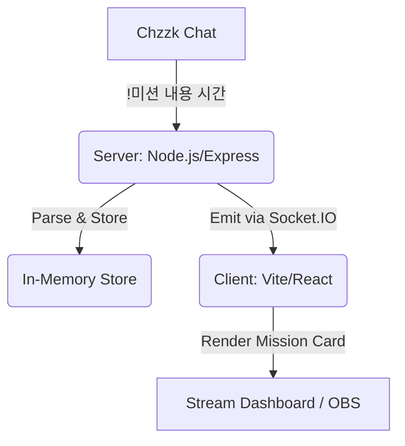

# Chzzk Mission Management System (치지직 미션 도우미)

이 프로젝트는 치지직(Chzzk) 스트리밍 채팅을 실시간으로 감시하여 특정 명령어를 파싱하고, 이를 세련된 전용 대시보드(오버레이)에 표시하는 시스템입니다.

## 🏗️ 시스템 아키텍처



## 🛠️ 기술 스택

### Backend (`/server`)
- **Node.js + Express**: 기본적인 API 서버 구성
- **Socket.io**: 서버에서 클라이언트로 미션 등록 정보를 실시간 전송
- **chzzk (npm library)**: 비공식 치지직 API를 활용하여 채팅방 연결 및 메시지 감시
- **ts-node-esm**: TypeScript 환경에서 ES Modules를 바로 실행

### Frontend (`/client`)
- **Vite + React (TypeScript)**: 고성능 웹 대시보드 환경
- **Framer Motion**: 미션 카드의 부드러운 등장/퇴장 및 카운트다운 애니메이션
- **Vanilla CSS (Glassmorphism)**: 고급스러운 유리 질감의 디자인 적용
- **Lucide React**: 현대적인 아이콘 라이브러리 사용

## 📜 핵심 로직 및 명령어 구조

### 명령어 형식
- `!미션 [내용] [시간(분)]`
- **예시**: `!미션 컵라면 한그릇 10`, `!미션 치킨먹방` (시간 생략 가능)

### 파싱 정규표현식
```typescript
const missionRegex = /^!미션\s+(.+?)(?:\s+(\d+))?$/;
```
1. `match[1]`: 미션 내용 (공백 포함 가능)
2. `match[2]`: 제한 시간 (선택 사항, 없으면 `null` 처리됨)

### 시간 처리 로직
- 시간이 입력되면 서버에서 `null` 대신 분 단위를 전달하고, 클라이언트는 `createdAt` 시점을 기준으로 실시간 카운트다운을 수행합니다.
- 시간이 없으면 화면에 "NO TIME LIMIT" 문구와 함께 무기한 미션으로 표시됩니다.

## ⚙️ 개발 설정 및 실행 방법

### 1. 초기 설치
각 폴더에서 의존성을 설치합니다.
```bash
# 서버 설치
cd server && npm install
# 클라이언트 설치
cd client && npm install
```

### 2. 환경 변수 설정 (`server/.env`)
`.env` 파일에 자신의 채널 ID를 입력합니다.
```env
PORT=4000
CHZZK_CHANNEL_ID=본인의_채널_ID
```
*채널 ID는 채널 주소 `https://chzzk.naver.com/{ChannelID}` 형태에서 확인할 수 있습니다.*

### 3. 프로젝트 실행
```bash
# 서버 실행 (터미널 1)
cd server && npm start

# 클라이언트 실행 (터미널 2)
cd client && npm run dev
```

## 🎨 UI/UX 디자인 가이드
- **OBS 최적화**: 배경을 `transparent`로 설정하여 오버레이로 즉시 사용 가능합니다.
- **Glassmorphism**: 브러시(Bluring) 효과와 미세한 외곽선(Border)을 통해 전문적인 방송 화면을 구성합니다.
- **Progress Bar**: 시간이 1분(60초) 미만으로 남으면 바의 색상이 **초록색 -> 빨간색**으로 변하며 긴박함을 연출합니다.

## 🤖 AI 학습을 위한 데이터 모델
```typescript
interface Mission {
  id: string;        // 고유 식별자 (Timestamp string)
  content: string;   // 미션 내용
  time: number|null; // 제한 시간(분), null일 경우 무제한
  createdAt: number; // 생성 시각 (UNIX Timestamp)
}
```
